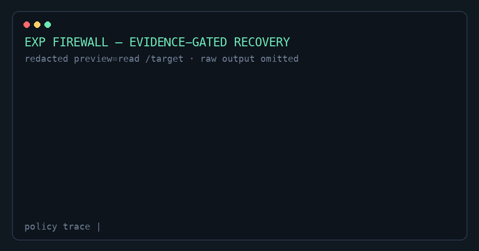

# Exp Firewall



Exp Firewall 是面向 DeepSeek Harness Agent 的本地、带来源且由 Evidence 约束的共享经验防火墙。它把结构化命令与文件读取结果记录为不可变 Observation，只允许独立 Principal 形成可撤销 Claim，并通过文件 Evidence 与唯一验证 Lease 防止过期经验阻塞已经恢复的环境。

[English](README.md)

## 安装与组合

安装到 DSH Profile：

```sh
dsh plugin --profile <profile> add exp-firewall
```

也可以直接安装下载的发布制品：

```sh
dsh plugin --profile <profile> add ./exp-firewall-0.1.2.tgz
```

Bundle 会先挂载 `exp-firewall/service`，再挂载 `exp-firewall` 策略 Consumer。`exp-firewall/dashboard` 默认禁用；只应在提供 `webServer` 的 Web Profile 中启用。发布包包含预构建 ESM 与 TypeScript 类型声明。

卸载时移除 `exp-firewall-service`、`exp-firewall` 和可选 `exp-firewall-dashboard` 三行。关闭流程依次停止新策略工作、移除只读订阅、排空 Evidence 失效、释放本进程 Lease、排空 Store 写入并关闭 SQLite。

## 配置与模式

完整默认配置见 [English README](README.md#configuration)。默认使用 `mode: warn` 与 `enforceStoreFailure: allow`：

- `observe`：记录并放行。
- `warn`：记录、放行，并附加稳定的模型可见提示。
- `enforce`：可以拒绝 corroborated 失败；Evidence 改变后只授予一个验证 Lease，其他 Principal 得到 `verification-in-progress`。

只有 `mode: enforce` 且显式设置 `enforceStoreFailure: deny` 才会在 Store 故障时 fail-closed。`policies.*.enforce: false` 可让某类动作回退为 warn 行为。

## 决策与模型体验

单个 Principal 最多形成 `suspected` Claim；第二个 Evidence 一致的独立 Principal 才能使其 `corroborated`。Evidence 缺失或不可比较时永不 `deny`。Evidence 改变会先把旧 Claim 变为 `stale`；一个 Principal 获得 Lease，其余等待。结构化成功验证会 `resolved`，结构化失败则 supersede 旧 Claim 并在新 epoch 创建 Claim。

结果分类只依赖结构化契约：命令使用整数 `exitCode`，文件读取共识失败只接受 `FS_NOT_FOUND`，绝不解析面向人的输出文本。每个可见 warning、deny、verify 与转换都可通过 operation、Observation、Claim、Session 和 tool-call ID 追踪。

## 只读界面

Dashboard 提供 summary、claims、claim detail 和 events 四个 GET API；browser plugin 在 DSH Web Settings 注册只读 Exp Firewall 页，默认每秒轮询，并渲染 Overview、可过滤/分页的 Claim Explorer 与带来源的 Claim Detail。界面提供简体中文与英文，跟随 DSH 全局语言设置即时切换，且不会重置 Dashboard 状态；scope、指纹、Evidence、Decision reason 等稳定审计值保持原样。CLI 仅提供 `status`、`claims`、`claim` 与 `events`，没有变更命令。独立运行 CLI 时可用 `EXP_FIREWALL_DATA_DIR` 指向数据目录。

## 数据与安全

SQLite 使用 WAL；支持 POSIX 权限的平台上，数据目录为 `0700`、数据库为 `0600`。Store 只保存完整指纹、Evidence、有限长度脱敏 preview、结构化失败码与来源，不保存原始工具输出或规范动作。HTTP、CLI 和 browser DTO 只暴露该只读模型；Dashboard 或订阅者故障不会影响策略写入；产品不估算 Token 节省。

## Demo 与验证

```sh
pnpm install
pnpm run check
pnpm run demo:consensus
pnpm run demo:evidence
pnpm run demo:concurrent
```

三个场景均不需要模型 API Key，并会将输出与确定性快照比较。更多说明见 [Demo 指南](demos/README.md)。

## 当前限制

Exp Firewall 当前仅支持单机 SQLite 上的精确命令与文件读取指纹，不提供恶意 Agent 身份抵抗、语义聚类、跨机器聚合、自动修复、因果恢复推断、Dashboard live push、写 API 或原始报告导出。
